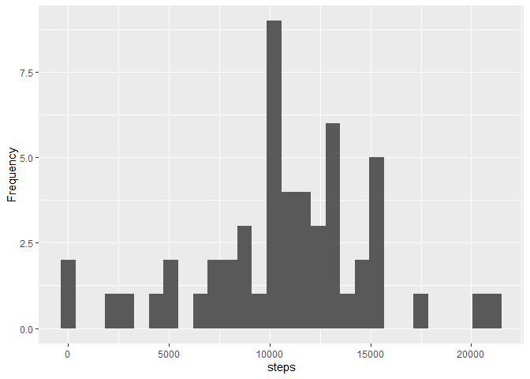
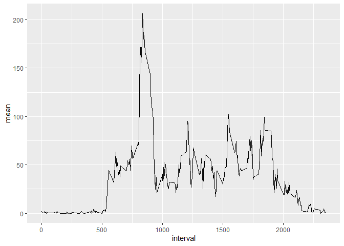
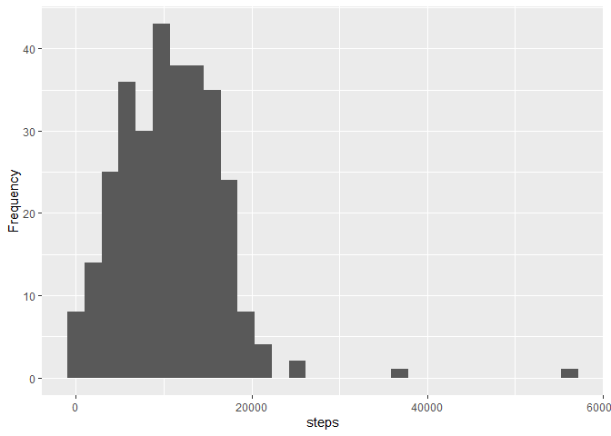
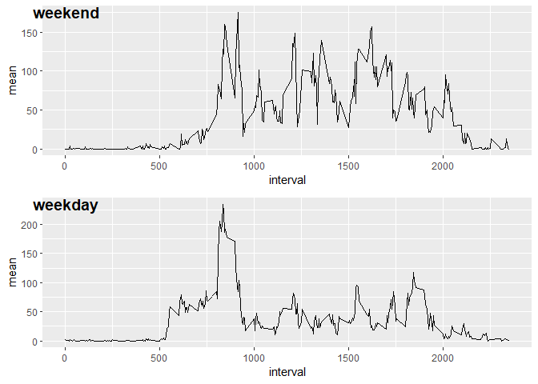

## Teste

### Code for reading in the dataset and/or processing the data

```r
temp <- tempfile()
download.file("https://d396qusza40orc.cloudfront.net/repdata%2Fdata%2Factivity.zip",temp)
data <- read.csv(unz(temp, "activity.csv"))
unlink(temp)
```

### Histogram of the total number of steps taken each day

```r
#Remove rows whose steps record is na
data1 <- data[which(!is.na(data$steps)),]

#Finds the unique records of the variable date
days <- unique(data1$date)

#Sum all records of same date
for (i in 1:length(days)){
  subset <- data1[which(data1$date == days[i]),]
  if(i == 1){
    df <- data.frame(days[1], sum(subset$steps))
  }else{
    df <- rbind(df, c(days[i], sum(subset$steps)))
  }
}

#Set column names
colnames(df) <- c("date","steps")

#Convert to integer
df$steps <- as.integer(df$steps)

#Histogram
library(ggplot2)

y <- ggplot(df, aes(x = steps)) 
a <- y + geom_histogram(bins = 30) + ylab("Frequency")
a
```

<!-- -->

### Mean and median number of steps taken each day

```r
#Mean and median of all records of same date
for (i in 1:length(days)){
  subset <- data1[which(data1$date == days[i]),]
  if(i == 1){
    df <- data.frame(days[1], round(mean(subset$steps), 2), median(subset$steps))
  }else{
    df <- rbind(df, c(days[i],  round(mean(subset$steps), 2), median(subset$steps)))
  }
}

#Set column names
colnames(df) <- c("date","mean", "median")

#Convert to double
df$mean <- as.double(df$mean)

df
```

```
##          date  mean median
## 1  2012-10-02  0.44      0
## 2  2012-10-03 39.42      0
## 3  2012-10-04 42.07      0
## 4  2012-10-05 46.16      0
## 5  2012-10-06 53.54      0
## 6  2012-10-07 38.25      0
## 7  2012-10-09 44.48      0
## 8  2012-10-10 34.38      0
## 9  2012-10-11 35.78      0
## 10 2012-10-12 60.35      0
## 11 2012-10-13 43.15      0
## 12 2012-10-14 52.42      0
## 13 2012-10-15 35.20      0
## 14 2012-10-16 52.38      0
## 15 2012-10-17 46.71      0
## 16 2012-10-18 34.92      0
## 17 2012-10-19 41.07      0
## 18 2012-10-20 36.09      0
## 19 2012-10-21 30.63      0
## 20 2012-10-22 46.74      0
## 21 2012-10-23 30.97      0
## 22 2012-10-24 29.01      0
## 23 2012-10-25  8.65      0
## 24 2012-10-26 23.53      0
## 25 2012-10-27 35.14      0
## 26 2012-10-28 39.78      0
## 27 2012-10-29 17.42      0
## 28 2012-10-30 34.09      0
## 29 2012-10-31 53.52      0
## 30 2012-11-02 36.81      0
## 31 2012-11-03 36.70      0
## 32 2012-11-05 36.25      0
## 33 2012-11-06 28.94      0
## 34 2012-11-07 44.73      0
## 35 2012-11-08 11.18      0
## 36 2012-11-11 43.78      0
## 37 2012-11-12 37.38      0
## 38 2012-11-13 25.47      0
## 39 2012-11-15  0.14      0
## 40 2012-11-16 18.89      0
## 41 2012-11-17 49.79      0
## 42 2012-11-18 52.47      0
## 43 2012-11-19 30.70      0
## 44 2012-11-20 15.53      0
## 45 2012-11-21 44.40      0
## 46 2012-11-22 70.93      0
## 47 2012-11-23 73.59      0
## 48 2012-11-24 50.27      0
## 49 2012-11-25 41.09      0
## 50 2012-11-26 38.76      0
## 51 2012-11-27 47.38      0
## 52 2012-11-28 35.36      0
## 53 2012-11-29 24.47      0
```

### Time series plot of the average number of steps taken

```r
#Finds the unique records of the variable interval
times <- unique(data1$interval)

#Mean of all records of same interval
for (i in 1:length(times)){
  subset <- data1[which(data1$interval == times[i]),]
  if(i == 1){
    df <- data.frame(times[1], round(mean(subset$steps), 2))
  }else{
    df <- rbind(df, c(times[i],  round(mean(subset$steps), 2)))
  }
}

#Set column names
colnames(df) <- c("interval","mean")

#Convert to double
df$mean <- as.double(df$mean)

y <- ggplot(df, aes(x = interval, y = mean))
b <- y + geom_line() # + geom_point()
b
```

<!-- -->

### The 5-minute interval that, on average, contains the maximum number of steps

```r
interval <- df[which(df$mean == max(df$mean)),]$interval
print(paste("The 5-minute interval that, on average, contains the maximum number of steps is", interval, "or", paste0(interval%/%100, ":", interval%%100)))
```

```
## [1] "The 5-minute interval that, on average, contains the maximum number of steps is 835 or 8:35"
```

### Code to describe and show a strategy for imputing missing data


#### Calculate and report the total number of missing values in the dataset (i.e. the total number of rows with \color{red}{\verb|NA|}NAs)

```r
print(paste("The total number of missing values in the dataset is", nrow(data[which(is.na(data$steps)),])))
```

```
## [1] "The total number of missing values in the dataset is 2304"
```

#### Devise a strategy for filling in all of the missing values in the dataset. The strategy does not need to be sophisticated. For example, you could use the mean/median for that day, or the mean for that 5-minute interval, etc. Create a new dataset that is equal to the original dataset but with the missing data filled in.


```r
#Copy data to NewData
NewData <- data

#Fill in NA values by mean for that 5-minute interval
for (i in 1:length(times)){
  NewData[which(NewData$interval == times[i] & is.na(NewData$steps)),] = df[which(df$interval == times[i]),]
}
```

### Histogram of the total number of steps taken each day after missing values are imputed

#### Make a histogram of the total number of steps taken each day and Calculate and report the mean and median total number of steps taken per day. 

```r
#Finds the unique records of the variable date
days <- unique(NewData$date)

#Sum all records of same date
for (i in 1:length(days)){
  subset <- NewData[which(NewData$date == days[i]),]
  if(i == 1){
    NewDf <- data.frame(days[1], sum(subset$steps))
  }else{
    NewDf <- rbind(NewDf, c(days[i], sum(subset$steps)))
  }
}

#Set column names
colnames(NewDf) <- c("date","steps")

#Convert to integer
NewDf$steps <- as.integer(NewDf$steps)

#Histogram
library(ggplot2)

y <- ggplot(NewDf, aes(x = steps)) 
a <- y + geom_histogram(bins = 30) + ylab("Frequency")
a
```

<!-- -->

```r
print(paste("The new mean and median are", round(mean(NewData$steps),2),"and", paste0(median(NewData$steps), ", respectively.")))
```

```
## [1] "The new mean and median are 186.91 and 0, respectively."
```

#### Do these values differ from the estimates from the first part of the assignment? 

```r
if(mean(NewData$steps) != mean(data1$steps)){ answer <- "The mean has changed"}else{answer <- "The mean hasn't changed"}

if(median(NewData$steps) != median(data1$steps)){ answer2 <-"the median has changed"}else{answer2 <- "the median hasn't changed"}

print(paste(answer,"and", answer2))
```

```
## [1] "The mean has changed and the median hasn't changed"
```

#### What is the impact of imputing missing data on the estimates of the total daily number of steps?

```r
if(sum(NewData$steps) - sum(data1$steps) > 0){ 
    answer <- paste("The number of steps increased", sum(NewData$steps) - sum(data1$steps), "steps.")
}else{
      answer <- paste("The number of steps decreased", sum(data1$steps) - sum(NewData$steps), "steps.")
}
print(answer)
```

```
## [1] "The number of steps increased 2712960 steps."
```

### Panel plot comparing the average number of steps taken per 5-minute interval across weekdays and weekends

#### Create a new factor variable in the dataset with two levels – “weekday” and “weekend” indicating whether a given date is a weekday or weekend day.

```r
#install.packages("timeDate")
library(timeDate)

#Returns TRUE if the day is weekend, otherwise it returns FALSE
weekendDay <- isWeekend(as.Date(data1$date))
Data1 <-cbind(data1, weekendDay)

#Set variable in the dataset with two levels – “weekday” and “weekend” indicating whether a given date is a weekday or weekend day.
Data1[which(Data1$weekendDay == TRUE),]$weekendDay <- "weekend"
Data1[which(Data1$weekendDay == FALSE),]$weekendDay <- "weekday"

#Transform to factor variable
Data1$weekendDay <- as.factor(Data1$weekendDay)
```

#### Make a panel plot containing a time series plot of the 5-minute interval (x-axis) and the average number of steps taken, averaged across all weekday days or weekend days (y-axis).

```r
#install.packages("ggpubr")
library(ggpubr)

typeOfDay <- c("weekday","weekend")

#Finds the unique records of the variable interval
times <- unique(Data1$interval)

#Mean of all records of same interval
for (i in 1:length(times)){
  for(j in 1:length(typeOfDay)){
    subset <- Data1[which(Data1$interval == times[i] & 
                            Data1$weekendDay == typeOfDay[j]),]
    if(j == 1){
      if(i == 1){
        df_weekday <- data.frame(times[1], round(mean(subset$steps), 2))
      }else{
        df_weekday <- rbind(df_weekday, c(times[i],  round(mean(subset$steps), 2)))
      }
    }else{
      if(i == 1){
        df_weekend <- data.frame(times[1], round(mean(subset$steps), 2))
      }else{
        df_weekend <- rbind(df_weekend, c(times[i],  round(mean(subset$steps), 2)))
      }      
    }
  }
}

#Set column names
colnames(df_weekday) <- c("interval","mean")
colnames(df_weekend) <- c("interval","mean")

#Convert to double
df_weekday$mean <- as.double(df_weekday$mean)
df_weekend$mean <- as.double(df_weekend$mean)

y <- ggplot(df_weekday, aes(x = interval, y = mean))
weekday <- y + geom_line() # + geom_point()

y <- ggplot(df_weekend, aes(x = interval, y = mean))
weekend <- y + geom_line() # + geom_point()


ggarrange(weekend, weekday, 
          labels = c("weekend", "weekday"),
          ncol = 1, nrow = 2)
```

<!-- -->


